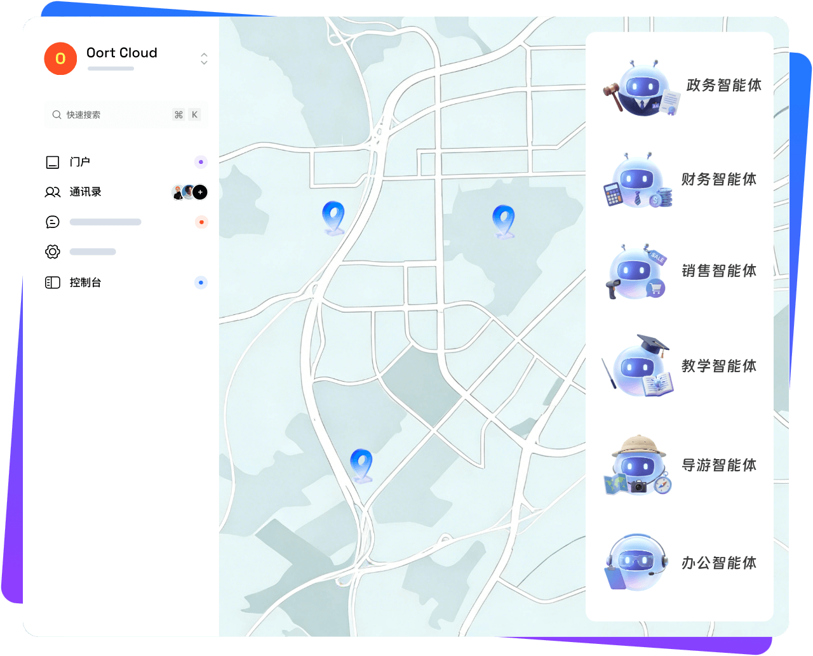

# OortCloud 官网

<p align="center">
  
</p>

<p align="center">
  <a href="https://nuxt.com/"></a>
  <a href="https://vuejs.org/"></a>
  <a href="https://www.typescriptlang.org/"></a>
  <a href="LICENSE"></a>
</p>

奥尔特云官网项目，基于 Nuxt 3、Vue 3 和 TypeScript 开发，主要展示 OortCloud 在公共安全、私有云、移动办公、行业数字化和 AI 智能体方向的产品与解决方案。

## 网站内容

### 首页

- 展示 OortCloud Super AI Agent、商业智能体、社区应用、企业软件能力和产品价值。
- 展示公共安全私有云智能化应用建设、警务宝一体机、指挥调度一张图、移动安全办公云平台、门户与应用仓库等核心能力。
- 包含硬件产品、软件产品、专业服务、合作伙伴和新闻中心入口。

### 产品中心

- 热门产品：云课堂、即时通讯、智能审批、门户与应用仓库、警务服务总线、指挥调度、K8S 容器管理、运维管理、档案管理、视频融合。
- 基础软件：安全移动办公、私有云、指挥调度与 IOC 大数据可视化。
- 应用软件：OA 数字化办公、智能客服、任务管理、党建宝、视频宝、警卫宝、天琴智宝。
- 云 SaaS：交通微劝导、反诈推广统计、互联网+公安政务服务等场景。

### 行业方案

- 移动警务、私有云、WorkUP 超级 APP、公共安全、智慧政务、智慧校园。
- 体育、电信、能源等行业数字化场景。
- 支持方案详情、视频演示、资料下载和体验入口。

### 社区与下载

- 社区文档、教学视频、产品日志和更新记录。
- 产品白皮书、彩页、演示视频、技术资料下载。
- 支持中英文等多语种页面入口。


## 技术栈

- Nuxt 3
- Vue 3
- TypeScript
- Element Plus
- Naive UI
- Pinia
- VueUse
- Sass
- postcss-px-to-viewport

## 目录结构

```text
src/
  assets/        静态样式、图标、产品图片
  components/    页面组件、导航、产品模块
  layouts/       页面布局
  pages/         路由页面，多语种页面和站点页面
  public/        公开访问资源、文档、视频、图片
thirdHtml/       AI 生成的独立 HTML 页面
```

## 本地开发

```bash
yarn install
yarn start
```

默认开发服务端口为 `8080`。

## 常用命令

```bash
# 本地开发
yarn start

# 生成静态站点
yarn generate

# 生产构建
yarn build

# 本地预览生产构建
yarn preview

# 检查并修复代码格式
yarn lint
```

## 环境变量

```bash
# 图片网关地址，可选
NUXT_PUBLIC_IMAGE_GATEWAY=https://workup-dev.myoumuamua.com:6433
```

## 部署说明

项目通过 Git tag 触发增量部署，不同前缀对应不同服务器目录。

```bash
git pull
git add .
git commit -m "feat: 更新官网内容"
git push origin main

# pc- 开头的 tag 只更新 pc 目录
git tag pc-v1.0.0
git push origin pc-v1.0.0

# sh- 开头的 tag 只更新 sh 目录
git tag sh-v1.0.0
git push origin sh-v1.0.0
```

更多部署配置可查看 [DEPLOY.md](DEPLOY.md) 和 [nginx.md](nginx.md)。

## 开源协议

本项目使用 [Apache License 2.0](LICENSE) 开源协议。

## 资源说明

仓库内包含产品截图、官网图片、文档和演示视频。开源使用时请确认品牌标识、产品资料和第三方素材的授权边界。
